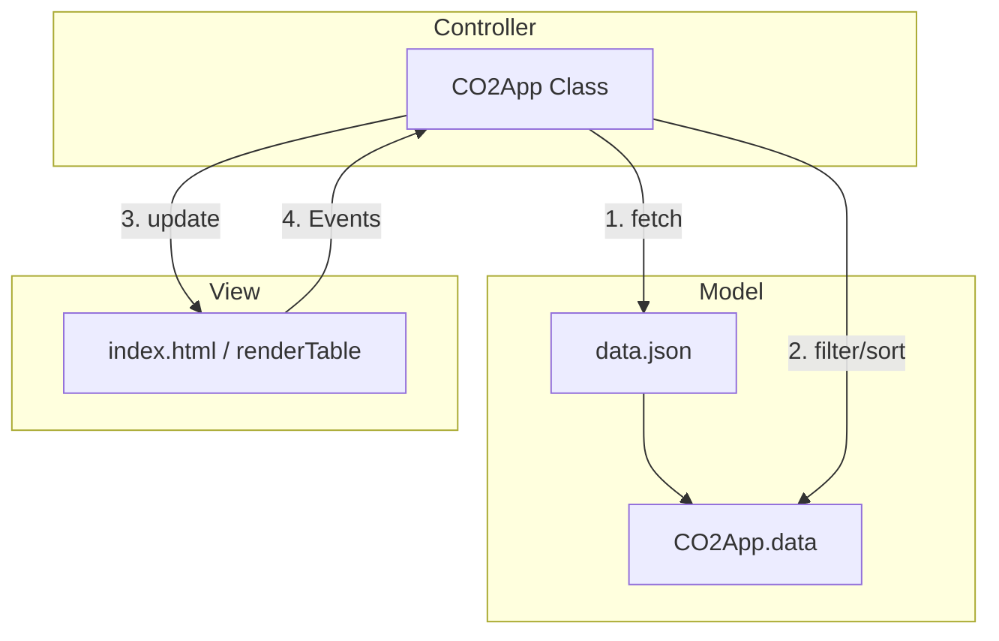

# CO2 Footprint Tracker

Eine professionelle Webanwendung zur Transparenz von globalen CO2-Emissionsdaten von Unternehmen und Ländern. Entwickelt als Fallstudie für eine Non-Profit-Organisation.

## 🚀 Features

- **Interaktive Datentabelle:** Sortierung und Filterung von Emissionsdaten in Echtzeit.
- **Responsive Design:** Optimierte Darstellung für Desktop, Tablet und Smartphone (Bootstrap 5).
- **Multikulturelle Unterstützung (RTL/LTR):** Dynamische Umschaltung des Layouts für Rechts-nach-Links-Schriftkulturen (z.B. Arabisch, Hebräisch).
- **Barrierefreiheit (A11y):** Einsatz von ARIA-Attributen und optimierten Farbkontrasten.
- **Performance-Optimiert:** Minimierung von Layout-Shifts (CLS) und Nutzung von Resource-Hints (Preconnect/Defer).

## 🏗 Architektur (MVC Pattern)

Die Anwendung folgt dem **Model-View-Controller (MVC)** Architekturmuster, um eine saubere Trennung von Daten, Logik und Darstellung zu gewährleisten.

- **Model:** Die `data.json` dient als Single Source of Truth für die Emissionsdaten.
- **View:** Die HTML-Struktur und die `renderTable`-Methode sind ausschließlich für die visuelle Aufbereitung zuständig.
- **Controller:** Die Klasse `CO2App` in `script.js` steuert den Datenfluss, verarbeitet Benutzereingaben (Suche/Sortierung) und aktualisiert die View.

## 🛡 Sicherheit & Best Practices

### Cross-Site Scripting (XSS) Schutz
Zur Erfüllung höchster Sicherheitsstandards werden alle dynamischen Inhalte mittels `textContent` an das DOM übergeben. Dies stellt sicher, dass potenziell injizierter Code (z.B. `<script>`) als reiner Text interpretiert und niemals ausgeführt wird.

### Subresource Integrity (SRI)
Externe Ressourcen (Bootstrap) werden mit kryptografischen Hashes eingebunden. Dies garantiert, dass die geladenen Dateien nicht durch Dritte manipuliert wurden.

### Layout-Stabilität
Durch die Reservierung von Mindesthöhen (`min-height`) wird der Cumulative Layout Shift (CLS) minimiert, was besonders beim asynchronen Laden der Daten für eine ruhige User Experience sorgt.

## 🛠 Technologien

- **HTML5:** Semantische Struktur und ARIA-Labels.
- **CSS3:** Custom Styles und Flexbox-Layouts.
- **JavaScript (ES6+):** Objektorientierte Umsetzung mittels Klassen.
- **Bootstrap 5:** Framework für responsives Grid und UI-Komponenten.

---
*Dieses Projekt wurde im Rahmen einer akademischen Fallstudie entwickelt.*
